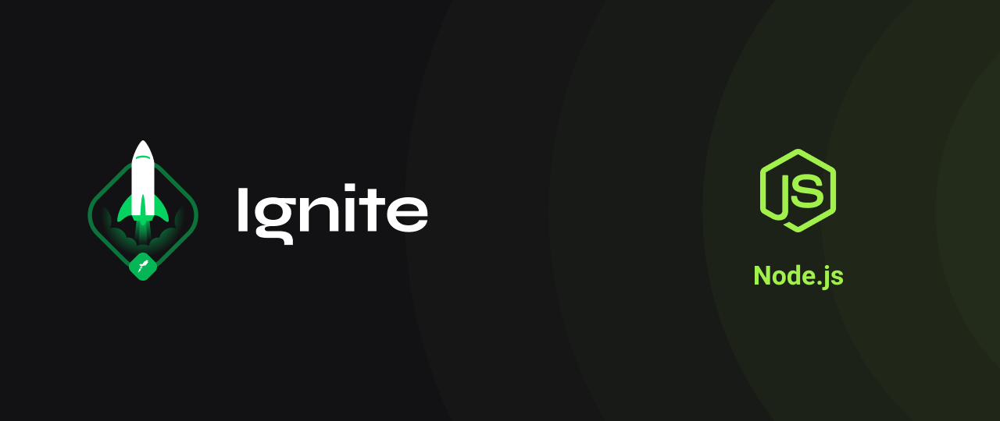

<h1 align="center">
    
</h1>

<h1 align="center">
    ⌨️ <a href="#" style="color:#04aa6d"> NodeJS 🚀 </a>
</h1>

<h3 align="center">
	Ignition sequence start: Ignite 2021
</h3>

<p align="center">
  

  

  <a href="https://github.com/andregda/ignite-nodejs/commits/master">
    
  </a>
    
   
   <a href="https://github.com/andregda/ignite-nodejs/stargazers">
    
  </a>

  <a href="https://andregda.github.io">
    
  </a>
</p>


<h4 align="center"> 
	 Status: Developinng
</h4>

<p align="center">
 <a href="#about">About</a> •
 <a href="#features">Features</a> •
 <a href="#layout">Layout</a> • 
 <a href="#how-it-works">How it works</a> • 
 <a href="#tech-stack">Tech Stack</a> • 
 <a href="#contributors">Contributors</a> • 
 <a href="#author">Author</a> • 
 <a href="#user-content-license">License</a>

</p>


## About

⚠️  Under construction ⚠️
</br>
Project developed during **Ignite Development Program** offered by [Rocketseat](https://www.rocketseat.com.br/).

---

## 'Challenges'

#### NodeJS:

Please follow the hyperlinks for the challenge solutions.

**Chapter I**
- [x] [Challenge: NodeJS Fundamentals](https://github.com/andregda/ignite-nodejs/tree/main/challenges/D1.1)
- [x] [Challenge: Working with Middlewares](https://github.com/andregda/ignite-nodejs/tree/main/challenges/D1.2)
- [x] [Challenge: Correcting the code](https://github.com/andregda/ignite-nodejs/tree/main/challenges/D1.3)

**Chapter II**
- [ ] Challenge: Introduction to SOLID
- [ ] Challenge: Documenting with Swagger

## Features

---

### Mobile

### Web

---

## How it works

### Pre-requisites

Before you begin, you will need to have the following tools installed on your machine:
[Git](https://git-scm.com), [Node.js](https://nodejs.org/en/).
In addition, it is good to have an editor to work with the code like [VSCode](https://code.visualstudio.com/), or go wild with [Neovim](https://neovim.io/).

#### Running the Backend (Server-side)

```bash

# Clone this repository
$ git clone git@github.com:andregda/ignite-nodejs.git

# Access the project folder cmd/terminal
$ cd ignite-nodejs

# go to the server folder
$ cd server

# install the dependencies
$ npm install

# Run the application in development mode
$ npm run dev:server

# The server will start at port: ${port} - go to http://localhost:${port}

```
<p align="center">
  ⚠️  Under construction ⚠️
  </br>
  <a href="https://github.com/andregda/ignite-nodejs/blob/master/Insomnia_API_CarVendor_json.json" target="_blank"></a>
</p>


#### Running the web application (Frontend)

```bash

# Clone this repository
$ git clone git@github.com:andregda/ignite-nodejs.git

# Access the project folder in your terminal
$ cd ignite-nodejs

# Go to the Front End application folder
$ cd web

# Install the dependencies
$ npm install

# Run the application in development mode
$ npm run start

# The application will open on the port: ${port} - go to http://localhost:${port}

```

---

## Tech Stack

The following tools were used in the construction of the project:
<!--
#### **Website**  ([React](https://reactjs.org/)  +  [TypeScript](https://www.typescriptlang.org/))

> See the file  [package.json](https://github.com/andregda/ignite-nodejs/blob/master/web/package.json)

#### [](https://github.com/andregda/ignite-nodejs#server-nodejs--typescript)**Server**  ([NodeJS](https://nodejs.org/en/)  +  [TypeScript](https://www.typescriptlang.org/))

> See the file  [package.json](https://github.com/andregda/ignite-nodejs/blob/master/server/package.json)

#### [](https://github.com/andregda/ignite-nodejs#mobile-react-native--typescript)**Mobile**  ([React Native](http://www.reactnative.com/)  +  [TypeScript](https://www.typescriptlang.org/))

-->

---

## Contributors

## How to contribute

1. Fork the project.
2. Create a new branch with your changes: `git checkout -b my-feature`
3. Save your changes and create a commit message telling you what you did: `git commit -m" feature: My new feature "`
4. Submit your changes: `git push origin my-feature`
> If you have any questions check this [guide on how to contribute](./CONTRIBUTING.md)

---

## Author

<a href="https://andregda.github.io">
 
 <br />
 <sub><b>André Arroxellas</b></sub></a> <a href="https://andregda.github.io" title="Blog"></a>
 <br />

[](https://www.linkedin.com/in/a-arroxellas/) 
[](mailto:a.arroxellas@gmail.com)

---

## License

This project is under the license [MIT](./LICENSE).

Made with love by André Arroxellas & Rocketseat Team 👋🏽 [Get in Touch!](Https://www.linkedin.com/in/a-arroxellas/)

---

##  Versions of README

<!--
[Portuguese](./README.md)  |  [English without emojis](./README-en.md) | [Portugueses without logo](./README-sem-logo.md) 
-->
